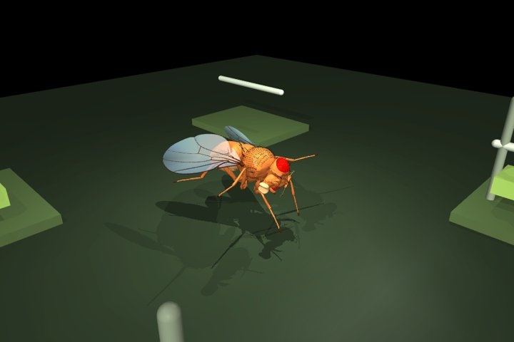

# Run the real-connectivity experiment

This integration has been executed with a real MaleCNS v1.0 subset and the upstream FlyBody MuJoCo model. It is a **tethered foreleg test**, not a complete brain emulation, walking fly, trained gym policy, or biological validation.

## Included

- `samples/mcns-dna02/`: 129 neurons and 3,813 recorded directed connections, selected around the two annotated DNa02 cells. Includes original synapse counts, VFB IDs, neurotransmitter annotations and hashes of the three original bulk source files.
- `simulation/lif.py`: sparse leaky integrate-and-fire dynamics with refractory periods, Poisson stimulation and filtered output rates.
- `simulation/body.py`: the actual FlyBody articulated body simulated in MuJoCo; thorax fixed for a controlled test. Two front-leg femur actuators receive neural readout commands.
- `simulation/server.py`: an interactive local lab with live physics render, stimulus sliders, pause/reset, feedback toggle and disconnect control.
- `reports/`: recorded connected and disconnected runs plus an actual MuJoCo render.

No 1.2 GB download is necessary to run the bundled subset.

## Install (Python 3.12)

```sh
python -m venv .venv
. .venv/bin/activate
pip install -r simulation/requirements.txt
sh scripts/setup_body.sh data/flybody
```

On Windows use `.venv\Scripts\activate` and clone FlyBody manually, then check out the commit below. The setup script pins FlyBody to `d015e9bfe441bd90ae431bac24c55cb74bdbce26` and preserves its upstream Apache-2.0 license. Its Python RL stack is not required: we load the model assets directly through MuJoCo. Core body geometry is unmodified; the runtime removes the thorax freejoint and adds static decorative gym props.

## Launch the local interactive lab

```sh
python -m simulation.server --circuit samples/mcns-dna02 --flybody data/flybody
```

Open **http://127.0.0.1:8765** in the same computer's browser. On a headless Linux system, prefix the command with `MUJOCO_GL=egl` where EGL is available. On macOS/Windows use the default renderer. The server deliberately binds to loopback; it has no authentication and is not configured for public hosting. Simulation/rendering runs in one worker thread, and the browser polls state and frames. Stopping the process stops the simulation. There is no unattended hosted service or checkpoint persistence yet.

Use the sliders to stimulate real upstream partners; they are not claimed to be identified sensory cells. Disconnecting synapses resets the deterministic seed and physics state. Baseline forces can still move limbs with the brain disconnected. Watch differences in output spikes, actuator commands and joint angles, not merely whether any movement exists.

## Reproduce the recorded experiment

```sh
python -m simulation.run --circuit samples/mcns-dna02 --flybody data/flybody --mode connected --seconds 1 --output data/connected.json
python -m simulation.run --circuit samples/mcns-dna02 --flybody data/flybody --mode disconnected --seconds 1 --output data/disconnected.json
python -m unittest discover -s tests -p 'test_*.py'
```

To render a still image append `--image data/physics.png`. Both the neural and physics timestep are 0.1 ms. Output JSON contains 10 ms samples. In the recorded seed-7 experiment, stimulation begins at 0.2 s and continues until 1 s. Input drive is 160 Hz left and 45 Hz right, reduced by 30 times the absolute corresponding joint angle; this feedback rule is artificial. Controls in the interactive lab instead apply immediately.

| Recorded result | Connected | All synapses disconnected |
| --- | ---: | ---: |
| Left DNa02 spikes | 188 | 0 |
| Right DNa02 spikes | 0 | 0 |
| Final left foreleg angle, rad | 0.392634 | 0.046994 |
| Final right foreleg angle, rad | 0.206059 | 0.030757 |

This supports **software-level causal coupling** in this chosen experiment. It does not demonstrate realistic sensory processing, locomotion, learning or exercise. The inactive right readout also illustrates the limits of a small, asymmetric circuit and untuned parameters. Right-leg angle can change mechanically even with zero right-output spikes.

## Dynamics and limitations

Membrane time constant 20 ms; synaptic current decay 5 ms; refractory period 2 ms; threshold 1; reset 0; output rate smoothing 50 ms. Each counted synapse contributes a model-current gain of 0.12. Stimulation adds 1.3 membrane units on a Poisson event. These are uncalibrated engineering assumptions. This is an independent experimental LIF implementation, not a reproduced Shiu model or fit to MaleCNS recordings.

Consensus acetylcholine is treated as excitatory, GABA and glutamate as inhibitory; other/unknown transmitters have zero outgoing contribution. This convention is explicitly not receptor-specific ground truth. The structural edge count includes those omitted contributions; their number is recorded in the sample metadata. No short-term plasticity, long-term learning, neuromodulatory dynamics, conduction delay model beyond the numerical update, or homeostasis is implemented.

DNa02 rates are mapped to foreleg target angles by a bounded artificial adapter. DNa02 is not asserted to innervate those actuators directly. There is no anatomically reconstructed VNC-to-muscle chain. The thorax tether avoids confusing an untrained controller's falls with meaningful walking. Equipment is fixed decoration, with no grasping, load transfer or hypertrophy mechanics.

## Rebuild the subset

```sh
python scripts/download_mcns.py --output data/mcns
python -m simulation.build_circuit --data data/mcns --output data/circuit
```

The builder inspects the official Feather schemas, selects the strongest 64 annotated incoming partners per DNa02 (ties by body ID), and retains the induced subgraph. The full raw connectivity file contains many unannotated segments; it is scanned in Arrow record batches rather than converted to one huge dense array. `--per-side` changes the size of this subset, not full-brain mode.

VFB's [data catalogue](https://www.virtualflybrain.org/docs/data/) is used as the anatomy/discovery reference. Connectivity and transmitter tables come from [the original MaleCNS bulk release](https://male-cns.janelia.org/download/). See `samples/mcns-dna02/ATTRIBUTION.md`.

## What remains for the full FlyGains concept

Free-body stable locomotion; validated sensory/descending mapping; a motor controller or motor-neuron-to-muscle model; learning/reward rules; equipment grasp/contact constraints; persistent simulation hosting; web frontend integration; custom GLB asset loading. The existing deployed 2D gym still runs its synthetic demo controller. Do not label it as the live MuJoCo experiment.

For custom equipment, follow [equipment-assets.md](equipment-assets.md).

## Rendered physics model


